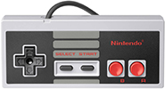

    

### Summary

- This repo is a list of all games I can remember playing.
- My most favorite genres show up at the top. In a genre, games are sorted by year.

### Table of Contents

- [MOBA](#moba)
- [Real-time strategy](#real-time-strategy)
- [Turn-based strategy](#turn-based-strategy)
- [Action-adventure](#action-adventure)
- [Fighting](#fighting)
- [Tower Defense](#tower-defense)
- [Simulation](#simulation)
- [Beat 'em up](#beat-em-up)
- [MMO](#mmo)
- [1st-person shooter](#1st-person-shooter)
- [Puzzle](#puzzle)
- [Cards](#cards)
- [Board](#board)
- [Music](#music)
- [Platform](#platform)
- [Shoot 'em up](#shoot-em-up)
- [Augmented Reality](#augmented-reality)
- [Sports](#sports)
- [Role-playing](#role-playing)
- [Party](#party)
- [Snake](#snake)
- [Racing](#racing)
- [Probability](#probability)
- [Other](#other)

### MOBA

| Game                                                                     | Year | System |                          Video                          |                                 Genre                                 |
|--------------------------------------------------------------------------|:----:|:------:|:-------------------------------------------------------:|:---------------------------------------------------------------------:|
| [League of Legends](https://en.wikipedia.org/wiki/League_of_Legends)     | 2009 |   PC   | [Gameplay](https://www.youtube.com/watch?v=fJVQNAEfaNM) | [MOBA](https://en.wikipedia.org/wiki/Multiplayer_online_battle_arena) |
| [Defense of the Ancients (DOTA) 2](https://en.wikipedia.org/wiki/Dota_2) | 2013 |   PC   | [Gameplay](https://www.youtube.com/watch?v=jUrQRnkSXzE) | [MOBA](https://en.wikipedia.org/wiki/Multiplayer_online_battle_arena) |

### Real-time strategy

| Game                                                                        | Year | System |                          Video                          |                                    Genre                                   |
|-----------------------------------------------------------------------------|:----:|:------:|:-------------------------------------------------------:|:--------------------------------------------------------------------------:|
| [Warcraft](https://en.wikipedia.org/wiki/Warcraft)                          | 1994 |   PC   | [Longplay](https://www.youtube.com/watch?v=PqczlhTpT2I) | [Real-Time Strategy](https://simple.wikipedia.org/wiki/Real-time_strategy) |
| [Starcraft](https://en.wikipedia.org/wiki/StarCraft)                        | 1998 |   PC   | [Gameplay](https://www.youtube.com/watch?v=AuWvMgYv03g) | [Real-Time Strategy](https://simple.wikipedia.org/wiki/Real-time_strategy) |
| [Starcraft 2](https://en.wikipedia.org/wiki/StarCraft_II:_Wings_of_Liberty) | 2010 |   PC   |         [Gameplay](https://youtu.be/Eg-jIWWemeQ)        | [Real-Time Strategy](https://simple.wikipedia.org/wiki/Real-time_strategy) |

### Turn-based strategy

| Game                                                                                                    | Year | System |                          Video                          |                                                                 Genre                                                                |
|---------------------------------------------------------------------------------------------------------|:----:|:------:|:-------------------------------------------------------:|:------------------------------------------------------------------------------------------------------------------------------------:|
| [Gorillas](https://en.wikipedia.org/wiki/Gorillas_%28video_game%29)                                     | 1991 |   PC   | [Longplay](https://www.youtube.com/watch?v=lyBD0X81tjk) | [Turn-based strategy](https://en.wikipedia.org/wiki/Turn-based_strategy) - [Artillery](https://en.wikipedia.org/wiki/Artillery_game) |
| [Heroes of Might & Magic 1](https://en.wikipedia.org/wiki/Heroes_of_Might_and_Magic:_A_Strategic_Quest) | 1995 |   PC   | [Longplay](https://www.youtube.com/watch?v=jahoqdju1pk) |                               [Turn-based strategy](https://en.wikipedia.org/wiki/Turn-based_strategy)                               |
| [Heroes of Might & Magic 2](https://en.wikipedia.org/wiki/Heroes_of_Might_and_Magic_II)                 | 1996 |   PC   | [Longplay](https://www.youtube.com/watch?v=YcIk7hr74k8) |                               [Turn-based strategy](https://en.wikipedia.org/wiki/Turn-based_strategy)                               |
| [Heroes of Might & Magic 3](https://en.wikipedia.org/wiki/Heroes_of_Might_and_Magic_III)                | 1999 |   PC   | [Longplay](https://www.youtube.com/watch?v=g7krLOZJE4Y) |                               [Turn-based strategy](https://en.wikipedia.org/wiki/Turn-based_strategy)                               |
| [Heroes of Might & Magic 6](https://en.wikipedia.org/wiki/Might_%26_Magic_Heroes_VI)                    | 2011 |   PC   | [Gameplay](https://www.youtube.com/watch?v=T3ZxXRvGW4o) |                               [Turn-based strategy](https://en.wikipedia.org/wiki/Turn-based_strategy)                               |
| [Civilization 6](https://en.wikipedia.org/wiki/Civilization_VI)                                         | 2016 |   PC   | [Gameplay](https://www.youtube.com/watch?v=dU41qtokZy4) |                               [Turn-based strategy](https://en.wikipedia.org/wiki/Turn-based_strategy)                               |

### Action-adventure

| Game                                                                                                             | Year |       System      |                            Video                           |                                  Genre                                  |
|------------------------------------------------------------------------------------------------------------------|:----:|:-----------------:|:----------------------------------------------------------:|:-----------------------------------------------------------------------:|
| [The Legend of Zelda](https://en.wikipedia.org/wiki/The_Legend_of_Zelda_(video_game))                            | 1986 |      Nintendo     |          [Longplay](https://youtu.be/RQ6hgzzk_o8)          | [Action-adventure](https://en.wikipedia.org/wiki/Action-adventure_game) |
| [Prince of Persia](https://en.wikipedia.org/wiki/Prince_of_Persia)                                               | 1989 |    Sega Genesis   |   [Longplay](https://www.youtube.com/watch?v=JDeIWfz_EM4)  | [Action-adventure](https://en.wikipedia.org/wiki/Action-adventure_game) |
| [Treasure Mountain](https://en.wikipedia.org/wiki/Treasure_Mountain!)                                            | 1990 |         PC        |   [Longplay](https://www.youtube.com/watch?v=9AlFhNsLY1E)  |        [Adventure](https://en.wikipedia.org/wiki/Adventure_game)        |
| [Wonder Boy in Monster World](https://en.wikipedia.org/wiki/Wonder_Boy_in_Monster_World)                         | 1992 |    Sega Genesis   |   [Longplay](https://www.youtube.com/watch?v=8VDaPFiLbAM)  | [Action-adventure](https://en.wikipedia.org/wiki/Action-adventure_game) |
| [Pirates Gold](https://en.wikipedia.org/wiki/Sid_Meier%27s_Pirates!#Release_history)                             | 1993 |    Sega Genesis   |   [Longplay](https://www.youtube.com/watch?v=2wGmBlkVvZM)  | [Action-adventure](https://en.wikipedia.org/wiki/Action-adventure_game) |
| [The Journeyman Project: Turbo](https://en.wikipedia.org/wiki/The_Journeyman_Project)                            | 1993 |         PC        |   [Longplay](https://www.youtube.com/watch?v=akv_sp-iMX8)  |        [Adventure](https://en.wikipedia.org/wiki/Adventure_game)        |
| [Zelda: Ocarina of Time](https://en.wikipedia.org/wiki/The_Legend_of_Zelda:_Ocarina_of_Time)                     | 1998 |    Nintendo 64    |   [Longplay](https://www.youtube.com/watch?v=_KO2a83jfas)  | [Action-adventure](https://en.wikipedia.org/wiki/Action-adventure_game) |
| [Shenmue](https://en.wikipedia.org/wiki/Shenmue)                                                                 | 1999 |     Dreamcast     |   [Longplay](https://www.youtube.com/watch?v=W8RpDgxAyKI)  | [Action-adventure](https://en.wikipedia.org/wiki/Action-adventure_game) |
| [Luigi's Mansion](https://en.wikipedia.org/wiki/Luigi%27s_Mansion)                                               | 2001 | Nintendo GameCube |   [Longplay](https://www.youtube.com/watch?v=9bWePif7psc)  | [Action-adventure](https://en.wikipedia.org/wiki/Action-adventure_game) |
| [The Lab](https://en.wikipedia.org/wiki/The_Lab_%28video_game%29)                                                | 2016 |         VR        |   [Gameplay](https://www.youtube.com/watch?v=yWgbGAx3P-M)  |           [Action](https://en.wikipedia.org/wiki/Action_game)           |
| [The Legend of Zelda: Breath of the Wild](https://en.wikipedia.org/wiki/The_Legend_of_Zelda:_Breath_of_the_Wild) | 2017 |  Nintendo Switch  |   [Gameplay](https://www.youtube.com/watch?v=zw47_q9wbBE)  | [Action-adventure](https://en.wikipedia.org/wiki/Action-adventure_game) |
| [Red Dead Redemption 2](https://en.wikipedia.org/wiki/Red_Dead_Redemption_2)                                     | 2019 |         PC        | [4K Gameplay](https://www.youtube.com/watch?v=lM-06ehsAu8) | [Action-adventure](https://en.wikipedia.org/wiki/Action-adventure_game) |

### Fighting

| Game                                                                                        | Year |       System      |                             Video                            |                          Genre                          |
|---------------------------------------------------------------------------------------------|------|:-----------------:|:------------------------------------------------------------:|:-------------------------------------------------------:|
| [Mortal Kombat 1](https://en.wikipedia.org/wiki/Mortal_Kombat_%281992_video_game%29)        | 1992 |    Sega Genesis   |    [Longplay](https://www.youtube.com/watch?v=RiwMEI2wNxQ)   | [Fighting](https://en.wikipedia.org/wiki/Fighting_game) |
| [Samurai Showdown](https://en.wikipedia.org/wiki/Samurai_Shodown_%281993_video_game%29)     | 1993 |    Sega Genesis   |    [Longplay](https://www.youtube.com/watch?v=-rzUx9cnG7g)   | [Fighting](https://en.wikipedia.org/wiki/Fighting_game) |
| [Eternal Champions](https://en.wikipedia.org/wiki/Eternal_Champions)                        | 1993 |    Sega Genesis   |    [Longplay](https://www.youtube.com/watch?v=8VEsAIYJYnY)   | [Fighting](https://en.wikipedia.org/wiki/Fighting_game) |
| [Mortal Kombat 2](https://en.wikipedia.org/wiki/Mortal_Kombat_II)                           | 1993 |    Sega Genesis   |    [Longplay](https://www.youtube.com/watch?v=MiXjiDZC5GA)   | [Fighting](https://en.wikipedia.org/wiki/Fighting_game) |
| [Super Street Fighter 2](https://en.wikipedia.org/wiki/Super_Street_Fighter_II)             | 1994 |    Sega Genesis   |    [Longplay](https://www.youtube.com/watch?v=s39J-6NgkFM)   | [Fighting](https://en.wikipedia.org/wiki/Fighting_game) |
| [One Must Fall](https://en.wikipedia.org/wiki/One_Must_Fall:_2097)                          | 1994 |         PC        |    [Longplay](https://www.youtube.com/watch?v=6fGM1cvUQv8)   | [Fighting](https://en.wikipedia.org/wiki/Fighting_game) |
| [Ultimate Mortal Kombat 3](https://en.wikipedia.org/wiki/Ultimate_Mortal_Kombat_3)          | 1995 |    Sega Genesis   |    [Longplay](https://www.youtube.com/watch?v=nJ_I_l2pqaI)   | [Fighting](https://en.wikipedia.org/wiki/Fighting_game) |
| [WWF War Zone](https://en.wikipedia.org/wiki/WWF_War_Zone)                                  | 1998 |    Nintendo 64    |    [Longplay](https://www.youtube.com/watch?v=FnZ2ifnqNbA)   | [Fighting](https://en.wikipedia.org/wiki/Fighting_game) |
| [Super Smash Brothers](https://en.wikipedia.org/wiki/Super_Smash_Bros._%28video_game%29)    | 1999 |    Nintendo 64    |    [Longplay](https://www.youtube.com/watch?v=h9UofM5LehY)   | [Fighting](https://en.wikipedia.org/wiki/Fighting_game) |
| [Soul Caliber](https://en.wikipedia.org/wiki/Soulcalibur_%28video_game%29)                  | 1999 |     Dreamcast     |    [Longplay](https://www.youtube.com/watch?v=TCTvTFnACLM)   | [Fighting](https://en.wikipedia.org/wiki/Fighting_game) |
| [Power Stone](https://en.wikipedia.org/wiki/Power_Stone)                                    | 1999 |     Dreamcast     |    [Longplay](https://www.youtube.com/watch?v=iIwIdHkYElY)   | [Fighting](https://en.wikipedia.org/wiki/Fighting_game) |
| [Dead or Alive 2](https://en.wikipedia.org/wiki/Dead_or_Alive_2)                            | 2000 |     Dreamcast     |    [Longplay](https://www.youtube.com/watch?v=JtkLFdui8Vo)   | [Fighting](https://en.wikipedia.org/wiki/Fighting_game) |
| [Marvel vs Capcom 2](https://en.wikipedia.org/wiki/Marvel_vs._Capcom_2:_New_Age_of_Heroes)  | 2000 |     Dreamcast     |    [Longplay](https://www.youtube.com/watch?v=i4El-7Skmgw)   | [Fighting](https://en.wikipedia.org/wiki/Fighting_game) |
| [Super Smash Brothers - Melee](https://en.wikipedia.org/wiki/Super_Smash_Bros._Melee)       | 2001 | Nintendo GameCube |    [Longplay](https://www.youtube.com/watch?v=f6UGXcqRuiE)   | [Fighting](https://en.wikipedia.org/wiki/Fighting_game) |
| [Tekken 7](https://en.wikipedia.org/wiki/Tekken_7)                                          | 2015 |   Playstation 4   | [Gameplay](https://youtu.be/mrzmlyOQW5c?si=_235ZtmI4CHeXvJg) | [Fighting](https://en.wikipedia.org/wiki/Fighting_game) |
| [Super Smash Brothers - Ultimate](https://en.wikipedia.org/wiki/Super_Smash_Bros._Ultimate) | 2018 |  Nintendo Switch  |    [Longplay](https://www.youtube.com/watch?v=663UvTXbzbM)   | [Fighting](https://en.wikipedia.org/wiki/Fighting_game) |
| [Soul Caliber 6](https://en.wikipedia.org/wiki/Soulcalibur_VI)                              | 2018 |   Playstation 5   | [Gameplay](https://youtu.be/noGeWEG_8LA?si=E8qVxYmdPkP-i_ed) | [Fighting](https://en.wikipedia.org/wiki/Fighting_game) |
| [Street Fighter 6](https://en.wikipedia.org/wiki/Street_Fighter_6)                          | 2023 |   Playstation 5   | [Gameplay](https://youtu.be/l9seXOvHU5M?si=CqGKp02dO0aXne_7) | [Fighting](https://en.wikipedia.org/wiki/Fighting_game) |
| [Mortal Kombat](https://en.wikipedia.org/wiki/Mortal_Kombat_1)                              | 2023 |   Playstation 5   | [Gameplay](https://youtu.be/43lNIjYvDKQ?si=A4gbGd71OOYxz8Ls) | [Fighting](https://en.wikipedia.org/wiki/Fighting_game) |

### Tower Defense

| Game                                                                                              | Year | System |                          Video                          |                             Genre                            |
|---------------------------------------------------------------------------------------------------|:----:|:------:|:-------------------------------------------------------:|:------------------------------------------------------------:|
| [Toy Defense Fantasy](https://en.wikipedia.org/wiki/Toy_Defense)                                  | 2014 | Mobile | [Gameplay](https://www.youtube.com/watch?v=K2EmU8epms4) | [Tower Defense](https://en.wikipedia.org/wiki/Tower_defense) |
| [Realm Defense](https://play.google.com/store/apps/details?id=com.babeltimeus.legendstd&hl=en_US) | 2016 | Mobile | [Gameplay](https://www.youtube.com/watch?v=BN6k6764ocE) | [Tower Defense](https://en.wikipedia.org/wiki/Tower_defense) |

### Simulation

| Game                                                                                            | Year | System |                          Video                          |                                                                    Genre                                                                   |
|-------------------------------------------------------------------------------------------------|:----:|:------:|:-------------------------------------------------------:|:------------------------------------------------------------------------------------------------------------------------------------------:|
| [The Oregon Trail](https://en.wikipedia.org/wiki/The_Oregon_Trail_%281985_video_game%29)        | 1985 |   PC   | [Longplay](https://www.youtube.com/watch?v=3Bgs9jfSo9k) |                                      [Simulation](https://en.wikipedia.org/wiki/Simulation_video_game)                                     |
| [SimCity](https://en.wikipedia.org/wiki/SimCity_%281989_video_game%29)                          | 1989 |   PC   | [Longplay](https://www.youtube.com/watch?v=A54blk-ojA4) | [Simulation](https://en.wikipedia.org/wiki/Simulation_video_game) - [City-building game](https://en.wikipedia.org/wiki/City-building_game) |
| [DinoPark Tycoon](https://en.wikipedia.org/wiki/DinoPark_Tycoon)                                | 1993 |   PC   | [Longplay](https://www.youtube.com/watch?v=8skFE4VlvOQ) |                                [Business simulation](https://en.wikipedia.org/wiki/Business_simulation_game)                               |
| [theBlu - Whale Encounter](https://store.steampowered.com/app/451520/theBlu)                    | 2016 |   VR   | [Gameplay](https://www.youtube.com/watch?v=dm7k8mrvA08) |                                      [Simulation](https://en.wikipedia.org/wiki/Simulation_video_game)                                     |
| [Tilt Brush](https://en.wikipedia.org/wiki/Tilt_Brush)                                          | 2016 |   VR   | [Gameplay](https://www.youtube.com/watch?v=TckqNdrdbgk) |                                      [Simulation](https://en.wikipedia.org/wiki/Simulation_video_game)                                     |
| [Everest VR](https://store.steampowered.com/app/384750/EVEREST_VR)                              | 2016 |   VR   | [Longplay](https://www.youtube.com/watch?v=QfxJfEtg78s) |                                      [Simulation](https://en.wikipedia.org/wiki/Simulation_video_game)                                     |
| [Richie's Plank Experience](https://store.steampowered.com/app/517160/Richies_Plank_Experience) | 2017 |   VR   | [Gameplay](https://www.youtube.com/watch?v=kGSMypiRsd8) |                                      [Simulation](https://en.wikipedia.org/wiki/Simulation_video_game)                                     |

### Beat 'em up

| Game                                                                                                                                 | Year |     System    |                             Video                            |                            Genre                           |
|--------------------------------------------------------------------------------------------------------------------------------------|------|:-------------:|:------------------------------------------------------------:|:----------------------------------------------------------:|
| [Streets of Rage 2](https://en.wikipedia.org/wiki/Streets_of_Rage_2)                                                                 | 1992 |  Sega Genesis |    [Longplay](https://www.youtube.com/watch?v=KG7MvthfOxY)   | [Beat 'em up](https://en.wikipedia.org/wiki/Beat_%27em_up) |
| [Teenage Mutant Ninja Turtles](https://en.wikipedia.org/wiki/Teenage_Mutant_Ninja_Turtles:_The_Hyperstone_Heist)                     | 1992 |  Sega Genesis |    [Longplay](https://www.youtube.com/watch?v=CRQOYZin6Bc)   | [Beat 'em up](https://en.wikipedia.org/wiki/Beat_%27em_up) |
| [Battletoads / Double Dragon](https://en.wikipedia.org/wiki/Battletoads/Double_Dragon)                                               | 1993 |  Sega Genesis |    [Longplay](https://www.youtube.com/watch?v=Fhu-VjBH1cg)   | [Beat 'em up](https://en.wikipedia.org/wiki/Beat_%27em_up) |
| [Streets of Rage 4](https://en.wikipedia.org/wiki/Streets_of_Rage_4)                                                                 | 2020 |       PC      |    [Gameplay](https://www.youtube.com/watch?v=-Jw6wK4GJds)   | [Beat 'em up](https://en.wikipedia.org/wiki/Beat_%27em_up) |
| [Teenage Mutant Ninja Turtles: Shredder's Revenge](https://en.wikipedia.org/wiki/Teenage_Mutant_Ninja_Turtles:_Shredder%27s_Revenge) | 2022 | Playstation 5 | [Longplay](https://youtu.be/Ak6ZWnmye2g?si=ndG6ZVih2D0SmuBG) | [Beat 'em up](https://en.wikipedia.org/wiki/Beat_%27em_up) |

### MMO

| Game                                                                | Year | System |                          Video                          |                                                                        Genre                                                                        |
|---------------------------------------------------------------------|:----:|:------:|:-------------------------------------------------------:|:---------------------------------------------------------------------------------------------------------------------------------------------------:|
| [Rec Room](https://en.wikipedia.org/wiki/Rec_Room_%28video_game%29) | 2016 |   VR   | [Gameplay](https://www.youtube.com/watch?v=nK1WOUiwiF4) | [Game creation system](https://en.wikipedia.org/wiki/Game_creation_system) - [MMO](https://en.wikipedia.org/wiki/Massively_multiplayer_online_game) |
| [VRChat](https://en.wikipedia.org/wiki/VRChat)                      | 2017 |   VR   | [Gameplay](https://www.youtube.com/watch?v=4yGLOHNPEhQ) |                                        [MMO](https://en.wikipedia.org/wiki/Massively_multiplayer_online_game)                                       |

### Puzzle

| Game                                                                         | Year |     System     |                          Video                          |                                        Genre                                        |
|------------------------------------------------------------------------------|:----:|:--------------:|:-------------------------------------------------------:|:-----------------------------------------------------------------------------------:|
| [Tetris](https://en.wikipedia.org/wiki/Tetris)                               | 1985 |       PC       | [Longplay](https://www.youtube.com/watch?v=X93SdCT0goE) |              [Puzzle](https://en.wikipedia.org/wiki/Puzzle_video_game)              |
| [Chip's Challenge](https://en.wikipedia.org/wiki/Chip%27s_Challenge)         | 1989 |       PC       | [Longplay](https://www.youtube.com/watch?v=UryCuGANc4o) |              [Puzzle](https://en.wikipedia.org/wiki/Puzzle_video_game)              |
| [Microsoft Minesweeper](https://en.wikipedia.org/wiki/Microsoft_Minesweeper) | 1990 |       PC       | [Longplay](https://www.youtube.com/watch?v=3ij476hcoes) |              [Puzzle](https://en.wikipedia.org/wiki/Puzzle_video_game)              |
| [Taipei](https://en.wikipedia.org/wiki/Microsoft_Entertainment_Pack)         | 1990 |       PC       | [Longplay](https://www.youtube.com/watch?v=y97wcs6rezQ) |              [Puzzle](https://en.wikipedia.org/wiki/Puzzle_video_game)              |
| [Rodent's Revenge](https://en.wikipedia.org/wiki/Rodent%27s_Revenge)         | 1991 |       PC       | [Longplay](https://www.youtube.com/watch?v=Fl7JdFeJ7Fk) |              [Puzzle](https://en.wikipedia.org/wiki/Puzzle_video_game)              |
| [Jezzball](https://en.wikipedia.org/wiki/JezzBall)                           | 1992 |       PC       | [Longplay](https://www.youtube.com/watch?v=wgwp7LiGiPk) |              [Puzzle](https://en.wikipedia.org/wiki/Puzzle_video_game)              |
| [Puggsy](https://en.wikipedia.org/wiki/Puggsy)                               | 1993 |  Sega Genesis  | [Longplay](https://www.youtube.com/watch?v=xCzEwdqjJsM) | [Puzzle-platform](https://en.wikipedia.org/wiki/Platform_game#Puzzle-platform_game) |
| [Wario's Woods](https://en.wikipedia.org/wiki/Wario%27s_Woods)               | 1994 | Super Nintendo | [Longplay](https://www.youtube.com/watch?v=qoO-OrzmQMQ) |              [Puzzle](https://en.wikipedia.org/wiki/Puzzle_video_game)              |
| [Candy Crush](https://en.wikipedia.org/wiki/Candy_Crush_Saga)                | 2012 |     Mobile     | [Gameplay](https://www.youtube.com/watch?v=d5Rf0An-jEg) |              [Puzzle](https://en.wikipedia.org/wiki/Puzzle_video_game)              |
| [I Love Hue](https://apps.apple.com/us/app/i-love-hue/id1081075274)          | 2019 |     Mobile     | [Longplay](https://www.youtube.com/watch?v=RAzddSG7DVA) |              [Puzzle](https://en.wikipedia.org/wiki/Puzzle_video_game)              |

### Cards

| Game                                                                                                       |                                                                           Year                                                                          | System |                              Video                             |                       Genre                      |
|------------------------------------------------------------------------------------------------------------|:-------------------------------------------------------------------------------------------------------------------------------------------------------:|:------:|:--------------------------------------------------------------:|:------------------------------------------------:|
| [Memory](https://en.wikipedia.org/wiki/Concentration_%28card_game%29)                                      | [1550](https://board-games-galore.fandom.com/wiki/Memory#:~:text=First%20published%20in%20today's%20form,Pairs%2C%20Pelmanism%2C%20or%20Concentration.) |  Cards |      [Rules](https://www.youtube.com/watch?v=492bM_dhdR4)      | [Cards](https://en.wikipedia.org/wiki/Card_game) |
| [Blackjack](https://en.wikipedia.org/wiki/Blackjack)                                                       |                                                 [1601](https://en.wikipedia.org/wiki/Blackjack#History)                                                 |  Cards |      [Rules](https://www.youtube.com/watch?v=eyoh-Ku9TCI)      | [Cards](https://en.wikipedia.org/wiki/Card_game) |
| [Pasur](https://en.wikipedia.org/wiki/Pasur_%28card_game%29)                                               |                                            [1850](https://en.wikipedia.org/wiki/Pasur_(card_game)#Etymology)                                            |  Cards | [Rules](https://en.wikipedia.org/wiki/Pasur_(card_game)#Rules) | [Cards](https://en.wikipedia.org/wiki/Card_game) |
| [Texas Hold 'Em](https://en.wikipedia.org/wiki/Texas_hold_%27em)                                           |                                                 [1906](https://www.quora.com/Who-invented-Texas-Hold-em)                                                |  Cards |      [Rules](https://www.youtube.com/watch?v=v8dqu_aVQk8)      | [Cards](https://en.wikipedia.org/wiki/Card_game) |
| [Uno](https://en.wikipedia.org/wiki/Uno_%28card_game%29)                                                   |                                                                           1971                                                                          |  Cards |      [Rules](https://www.youtube.com/watch?v=dicgjskLVJc)      | [Cards](https://en.wikipedia.org/wiki/Card_game) |
| [Kemps](https://en.wikipedia.org/wiki/Kemps_%28card_game%29)                                               |                                                                            ?                                                                            |  Cards |      [Rules](https://www.youtube.com/watch?v=FHuIcGzNgYg)      | [Cards](https://en.wikipedia.org/wiki/Card_game) |
| [Microsoft Solitaire](https://en.wikipedia.org/wiki/Microsoft_Solitaire)                                   |                                                                           1990                                                                          |   PC   |     [Longplay](https://www.youtube.com/watch?v=fJWyWJXWTkc)    | [Cards](https://en.wikipedia.org/wiki/Card_game) |
| [Magic: The Gathering](https://en.wikipedia.org/wiki/Magic:_The_Gathering)                                 |                                                                           1993                                                                          |  Cards |      [Rules](https://www.youtube.com/watch?v=DCVGwmCtRwA)      | [Cards](https://en.wikipedia.org/wiki/Card_game) |
| [Pokemon Trading Card Game](https://en.wikipedia.org/wiki/Pok%C3%A9mon_Trading_Card_Game)                  |                                                                           1996                                                                          |  Cards |      [Rules](https://www.youtube.com/watch?v=WMJnJVW5dNU)      | [Cards](https://en.wikipedia.org/wiki/Card_game) |
| [Magic: The Gathering Shandalar](https://en.wikipedia.org/wiki/Magic:_The_Gathering_%281997_video_game%29) |                                                                           1997                                                                          |   PC   |     [Gameplay](https://www.youtube.com/watch?v=Z2xKo6zle-o)    | [Cards](https://en.wikipedia.org/wiki/Card_game) |
| [Magic: The Gathering Online](https://en.wikipedia.org/wiki/Magic:_The_Gathering_Online)                   |                                                                           2002                                                                          |   PC   |     [Gameplay](https://www.youtube.com/watch?v=2rC6-GZEtUI)    | [Cards](https://en.wikipedia.org/wiki/Card_game) |
| [Dominion](https://en.wikipedia.org/wiki/Dominion_%28card_game%29)                                         |                                                                           2008                                                                          |  Cards |      [Rules](https://www.youtube.com/watch?v=5jNGpgdMums)      | [Cards](https://en.wikipedia.org/wiki/Card_game) |
| [Hearthstone](https://en.wikipedia.org/wiki/Hearthstone)                                                   |                                                                           2014                                                                          |   PC   |     [Gameplay](https://www.youtube.com/watch?v=ymuVLuVlsOU)    | [Cards](https://en.wikipedia.org/wiki/Card_game) |

### Board

| Game                                                                                   |                               Year                              | System |                                            Video                                           |                                                         Genre                                                        |
|----------------------------------------------------------------------------------------|:---------------------------------------------------------------:|:------:|:------------------------------------------------------------------------------------------:|:--------------------------------------------------------------------------------------------------------------------:|
| [Checkers](https://en.wikipedia.org/wiki/Draughts)                                     |     [-3000](https://en.wikipedia.org/wiki/Draughts#History)     |  Board |                    [Rules](https://www.youtube.com/watch?v=MOW9k_C4vFU)                    |                                   [Board](https://en.wikipedia.org/wiki/Board_game)                                  |
| [Backgammon](https://en.wikipedia.org/wiki/Backgammon)                                 |        [-3000](https://en.wikipedia.org/wiki/Backgammon)        |  Board |                    [Rules](https://www.youtube.com/watch?v=KDvvKWi0ijs)                    |                                   [Board](https://en.wikipedia.org/wiki/Board_game)                                  |
| [Tic-tac-toe](https://en.wikipedia.org/wiki/Tic-tac-toe)                               |    [-1300](https://en.wikipedia.org/wiki/Tic-tac-toe#History)   |  Board |                    [Rules](https://www.youtube.com/watch?v=5SdW0_wTX5c)                    |                                   [Board](https://en.wikipedia.org/wiki/Board_game)                                  |
| [Chess](https://en.wikipedia.org/wiki/Chess)                                           |        [280](https://en.wikipedia.org/wiki/Chess#History)       |  Board |                    [Rules](https://www.youtube.com/watch?v=NAIQyoPcjNM)                    |                                   [Board](https://en.wikipedia.org/wiki/Board_game)                                  |
| [Chinese Checkers](https://en.wikipedia.org/wiki/Chinese_checkers)                     |                               1892                              |  Board |                    [Rules](https://www.youtube.com/watch?v=kVEAfbecmo0)                    |                                   [Board](https://en.wikipedia.org/wiki/Board_game)                                  |
| [Battleship](https://en.wikipedia.org/wiki/Battleship_%28game%29)                      | [1931](https://en.wikipedia.org/wiki/Battleship_(game)#History) |  Board |                    [Rules](https://www.youtube.com/watch?v=q0qpQ8doUp8)                    |                                   [Board](https://en.wikipedia.org/wiki/Board_game)                                  |
| [Monopoly](https://en.wikipedia.org/wiki/Monopoly_%28game%29)                          |                               1935                              |  Board |                    [Rules](https://www.youtube.com/watch?v=AuWvMgYv03g)                    |                                   [Board](https://en.wikipedia.org/wiki/Board_game)                                  |
| [Domination](https://en.wikipedia.org/wiki/Focus_%28board_game%29)                     |                               1964                              |  Board | [Gameplay](https://www.youtube.com/results?search_query=domination+board+game+how+to+play) |                                   [Board](https://en.wikipedia.org/wiki/Board_game)                                  |
| [Mastermind](https://en.wikipedia.org/wiki/Mastermind_%28board_game%29)                |                               1970                              |  Board |                    [Rules](https://www.youtube.com/watch?v=wsYPsrzCKiA)                    |                                   [Board](https://en.wikipedia.org/wiki/Board_game)                                  |
| [Othello](https://en.wikipedia.org/wiki/Reversi)                                       |                               1971                              |  Board |                    [Rules](https://www.youtube.com/watch?v=Ol3Id7xYsY4)                    |                                   [Board](https://en.wikipedia.org/wiki/Board_game)                                  |
| [Connect Four](https://en.wikipedia.org/wiki/Connect_Four)                             |                               1974                              |  Board |                    [Rules](https://www.youtube.com/watch?v=ylZBRUJi3UQ)                    |                                   [Board](https://en.wikipedia.org/wiki/Board_game)                                  |
| [Rubik's Race](https://www.ultraboardgames.com/rubiks-cube/rubiks-race-game-rules.php) |                               1982                              |  Board |                   [Gameplay](https://www.youtube.com/watch?v=PWHsHsZdBKA)                  |                                   [Board](https://en.wikipedia.org/wiki/Board_game)                                  |
| [Jenga](https://en.wikipedia.org/wiki/Jenga)                                           |                               1984                              |  Board |                    [Rules](https://www.youtube.com/watch?v=pbE6SRQ7PoA)                    |                                   [Board](https://en.wikipedia.org/wiki/Board_game)                                  |
| [Go For Broke](https://boardgamegeek.com/boardgame/3343/go-broke)                      |                               1985                              |  Board |                   [Gameplay](https://www.youtube.com/watch?v=esba6ZDjfIs)                  |                                   [Board](https://en.wikipedia.org/wiki/Board_game)                                  |
| [Abalone](https://en.wikipedia.org/wiki/Abalone_%28board_game%29)                      |                               1987                              |  Board |                    [Rules](https://www.youtube.com/watch?v=JmSOs3dGpyc)                    |                                   [Board](https://en.wikipedia.org/wiki/Board_game)                                  |
| [Terrace](https://en.wikipedia.org/wiki/Terrace_%28board_game%29)                      |                               1991                              |  Board |                    [Rules](https://www.youtube.com/watch?v=Fe80g3RdrJQ)                    |                                   [Board](https://en.wikipedia.org/wiki/Board_game)                                  |
| [Settlers of Catan](https://en.wikipedia.org/wiki/Catan)                               |                               1995                              |  Board |                    [Rules](https://www.youtube.com/watch?v=8Yj0Y3GKE40)                    |                                   [Board](https://en.wikipedia.org/wiki/Board_game)                                  |
| [Carcassonne](https://en.wikipedia.org/wiki/Carcassonne_%28board_game%29)              |                               2000                              |  Board |                    [Rules](https://www.youtube.com/watch?v=-74FYj21JVg)                    |                                   [Board](https://en.wikipedia.org/wiki/Board_game)                                  |
| [Ticket to Ride](https://en.wikipedia.org/wiki/Ticket_to_Ride_%28board_game%29)        |                               2004                              |  Board |                    [Rules](https://www.youtube.com/watch?v=4JhFhyvGdik)                    |                                   [Board](https://en.wikipedia.org/wiki/Board_game)                                  |
| [Pentago](https://en.wikipedia.org/wiki/Pentago)                                       |                               2005                              |  Board |                    [Rules](https://www.youtube.com/watch?v=8DgUsC_X0QI)                    | [Board](https://en.wikipedia.org/wiki/Board_game) - [Abstract Strategy](https://www.youtube.com/watch?v=8DgUsC_X0QI) |
| [Pandemic](https://en.wikipedia.org/wiki/Pandemic_%28board_game%29)                    |                               2008                              |  Board |                    [Rules](https://www.youtube.com/watch?v=4RxqzBA_HRs)                    |                                   [Board](https://en.wikipedia.org/wiki/Board_game)                                  |
| [Small World](https://en.wikipedia.org/wiki/Small_World_%28board_game%29)              |                               2009                              |  Board |                    [Rules](https://www.youtube.com/watch?v=BMxt7OVj_lI)                    |                                   [Board](https://en.wikipedia.org/wiki/Board_game)                                  |

### Music

| Game                                                                           | Year |     System    |                          Video                          |                                                     Genre                                                     |
|--------------------------------------------------------------------------------|:----:|:-------------:|:-------------------------------------------------------:|:-------------------------------------------------------------------------------------------------------------:|
| [Dance Dance Revolution](https://en.wikipedia.org/wiki/Dance_Dance_Revolution) | 1998 |     Arcade    |   [Rules](https://www.youtube.com/watch?v=SLGVvDMj7rE)  | [Music](https://en.wikipedia.org/wiki/Music_video_game) - [Rhythm](https://en.wikipedia.org/wiki/Rhythm_game) |
| [Guitar Hero](https://en.wikipedia.org/wiki/Guitar_Hero_%28video_game%29)      | 2005 | Playstation 2 | [Longplay](https://www.youtube.com/watch?v=_eJ-ri3SoAs) | [Music](https://en.wikipedia.org/wiki/Music_video_game) - [Rhythm](https://en.wikipedia.org/wiki/Rhythm_game) |
| [Beat Saber](https://en.wikipedia.org/wiki/Beat_Saber)                         | 2019 |       VR      | [Longplay](https://www.youtube.com/watch?v=muEu5XORkkc) | [Music](https://en.wikipedia.org/wiki/Music_video_game) - [Rhythm](https://en.wikipedia.org/wiki/Rhythm_game) |

### Platform

| Game                                                                                                            | Year |       System      |                          Video                          |                                                                     Genre                                                                     |
|-----------------------------------------------------------------------------------------------------------------|:----:|:-----------------:|:-------------------------------------------------------:|:---------------------------------------------------------------------------------------------------------------------------------------------:|
| [Popeye](https://en.wikipedia.org/wiki/Popeye_%28video_game%29)                                                 | 1982 |      Nintendo     | [Longplay](https://www.youtube.com/watch?v=MYNFWm4sJO8) |                                            [Platform](https://en.wikipedia.org/wiki/Platform_game)                                            |
| [Donkey Kong 2](https://en.wikipedia.org/wiki/List_of_LCD_games_featuring_Mario#Donkey_Kong_II)                 | 1983 |      Nintendo     | [Longplay](https://www.youtube.com/watch?v=HfKoEWN65Qo) |                                            [Platform](https://en.wikipedia.org/wiki/Platform_game)                                            |
| [Marble Madness](https://en.wikipedia.org/wiki/Marble_Madness)                                                  | 1984 |      Nintendo     | [Gameplay](https://www.youtube.com/watch?v=CvlbZwoWMgA) |                                            [Platform](https://en.wikipedia.org/wiki/Platform_game)                                            |
| [Super Mario 1](https://en.wikipedia.org/wiki/Super_Mario_Bros.)                                                | 1985 |      Nintendo     | [Longplay](https://www.youtube.com/watch?v=7qirrV8w5SQ) |                                            [Platform](https://en.wikipedia.org/wiki/Platform_game)                                            |
| [Super Mario 2](https://en.wikipedia.org/wiki/Super_Mario_Bros._2)                                              | 1988 |      Nintendo     | [Longplay](https://www.youtube.com/watch?v=Izc1yLUxPIw) |                                            [Platform](https://en.wikipedia.org/wiki/Platform_game)                                            |
| [Super Mario 3](https://en.wikipedia.org/wiki/Super_Mario_Bros._3)                                              | 1989 |      Nintendo     | [Longplay](https://www.youtube.com/watch?v=c2LTcQwmOV4) |                                            [Platform](https://en.wikipedia.org/wiki/Platform_game)                                            |
| [Teenage Mutant Ninja Turtles](https://en.wikipedia.org/wiki/Teenage_Mutant_Ninja_Turtles_%28NES_video_game%29) | 1989 |      Nintendo     | [Longplay](https://www.youtube.com/watch?v=LRg-yK-O1t0) |                                            [Platform](https://en.wikipedia.org/wiki/Platform_game)                                            |
| [Astyanax](https://en.wikipedia.org/wiki/The_Astyanax)                                                          | 1990 |      Nintendo     | [Longplay](https://www.youtube.com/watch?v=Yt2CU8H7BMI) |                                            [Platform](https://en.wikipedia.org/wiki/Platform_game)                                            |
| [Joe and Mac](https://en.wikipedia.org/wiki/Joe_%26_Mac)                                                        | 1991 |    Sega Genesis   | [Longplay](https://www.youtube.com/watch?v=zUSKTgYQJZ4) |                                            [Platform](https://en.wikipedia.org/wiki/Platform_game)                                            |
| [Super Mario World](https://en.wikipedia.org/wiki/Super_Mario_World)                                            | 1991 |   Super Nintendo  | [Longplay](https://www.youtube.com/watch?v=l0XtXB0fEaA) |                                            [Platform](https://en.wikipedia.org/wiki/Platform_game)                                            |
| [Sonic the Hedgehog 1](https://en.wikipedia.org/wiki/Sonic_the_Hedgehog_%281991_video_game%29)                  | 1991 |    Sega Genesis   | [Longplay](https://www.youtube.com/watch?v=Gsa_4s3CjmI) |                                            [Platform](https://en.wikipedia.org/wiki/Platform_game)                                            |
| [Sonic the Hedgehog 2](https://en.wikipedia.org/wiki/Sonic_the_Hedgehog_2)                                      | 1992 |    Sega Genesis   | [Longplay](https://www.youtube.com/watch?v=8cr1rqVcIhA) |                                            [Platform](https://en.wikipedia.org/wiki/Platform_game)                                            |
| [Greendog](https://en.wikipedia.org/wiki/Greendog:_The_Beached_Surfer_Dude!)                                    | 1992 |    Sega Genesis   | [Longplay](https://www.youtube.com/watch?v=yjKGdI0egEk) |                                            [Platform](https://en.wikipedia.org/wiki/Platform_game)                                            |
| [Global Gladiators](https://en.wikipedia.org/wiki/Global_Gladiators)                                            | 1992 |    Sega Genesis   | [Longplay](https://www.youtube.com/watch?v=yy9_-iEdXAA) |                                            [Platform](https://en.wikipedia.org/wiki/Platform_game)                                            |
| [Rocket Knight Adventures](https://en.wikipedia.org/wiki/Rocket_Knight_Adventures)                              | 1993 |    Sega Genesis   | [Longplay](https://www.youtube.com/watch?v=dtId7oQz8-s) |                                            [Platform](https://en.wikipedia.org/wiki/Platform_game)                                            |
| [Cool Spot](https://en.wikipedia.org/wiki/Cool_Spot)                                                            | 1993 |    Sega Genesis   | [Longplay](https://www.youtube.com/watch?v=MTROI2ODRM4) |                                            [Platform](https://en.wikipedia.org/wiki/Platform_game)                                            |
| [Aladdin](https://en.wikipedia.org/wiki/Disney%27s_Aladdin_%28Capcom_video_game%29)                             | 1993 |   Super Nintendo  | [Longplay](https://www.youtube.com/watch?v=G9m2gAuWkOY) |                                            [Platform](https://en.wikipedia.org/wiki/Platform_game)                                            |
| [Bram Stoker's Dracula](https://en.wikipedia.org/wiki/Bram_Stoker%27s_Dracula_%28video_game%29)                 | 1993 |    Sega Genesis   | [Longplay](https://www.youtube.com/watch?v=yNTV8pD1M2c) |                                            [Platform](https://en.wikipedia.org/wiki/Platform_game)                                            |
| [Megaman X](https://en.wikipedia.org/wiki/Mega_Man_X)                                                           | 1993 |   Super Nintendo  | [Longplay](https://www.youtube.com/watch?v=wd2NqblSmIY) |                                            [Platform](https://en.wikipedia.org/wiki/Platform_game)                                            |
| [ToeJam & Earl](https://en.wikipedia.org/wiki/ToeJam_%26_Earl_in_Panic_on_Funkotron)                            | 1993 |    Sega Genesis   | [Longplay](https://www.youtube.com/watch?v=m1JXmIIqoms) |                                            [Platform](https://en.wikipedia.org/wiki/Platform_game)                                            |
| [Bubsy](https://en.wikipedia.org/wiki/Bubsy_in_Claws_Encounters_of_the_Furred_Kind)                             | 1993 |    Sega Genesis   | [Longplay](https://www.youtube.com/watch?v=BSkSqtgmBrM) |                                            [Platform](https://en.wikipedia.org/wiki/Platform_game)                                            |
| [Sonic the Hedgehog 3](https://en.wikipedia.org/wiki/Sonic_the_Hedgehog_3)                                      | 1994 |    Sega Genesis   | [Longplay](https://www.youtube.com/watch?v=j350HVcB2dA) |                                            [Platform](https://en.wikipedia.org/wiki/Platform_game)                                            |
| [Sonic & Knuckles](https://en.wikipedia.org/wiki/Sonic_%26_Knuckles)                                            | 1994 |    Sega Genesis   | [Longplay](https://www.youtube.com/watch?v=CUGH2xkozX0) |                                            [Platform](https://en.wikipedia.org/wiki/Platform_game)                                            |
| [Jazz Jackrabbit](https://en.wikipedia.org/wiki/Jazz_Jackrabbit_%281994_video_game%29)                          | 1994 |         PC        | [Longplay](https://www.youtube.com/watch?v=rtyCMVyMXgw) |                                            [Platform](https://en.wikipedia.org/wiki/Platform_game)                                            |
| [Crash Bandicoot](https://en.wikipedia.org/wiki/Crash_Bandicoot_%28video_game%29)                               | 1996 |    Playstation    | [Longplay](https://www.youtube.com/watch?v=9HtPF0ers1w) |                                            [Platform](https://en.wikipedia.org/wiki/Platform_game)                                            |
| [Super Mario 64](https://en.wikipedia.org/wiki/Super_Mario_64)                                                  | 1996 |    Nintendo 64    | [Longplay](https://www.youtube.com/watch?v=0ED8iq7pvwo) |                                            [Platform](https://en.wikipedia.org/wiki/Platform_game)                                            |
| [Sonic Adventure](https://en.wikipedia.org/wiki/Sonic_Adventure)                                                | 1998 |     Dreamcast     | [Longplay](https://www.youtube.com/watch?v=Bd9Duv-6pFg) |                                            [Platform](https://en.wikipedia.org/wiki/Platform_game)                                            |
| [Super Mario Sunshine](https://en.wikipedia.org/wiki/Super_Mario_Sunshine)                                      | 2002 | Nintendo GameCube | [Longplay](https://www.youtube.com/watch?v=Hg7Xu_C95vQ) |                                            [Platform](https://en.wikipedia.org/wiki/Platform_game)                                            |
| [Temple Run 2](https://en.wikipedia.org/wiki/Temple_Run_2)                                                      | 2013 |       Mobile      | [Longplay](https://www.youtube.com/watch?v=3I69oaWrv6I) | [Platform](https://en.wikipedia.org/wiki/Platform_game) - [Endless Runner](https://en.wikipedia.org/wiki/Platform_game#Endless_running_games) |

### Shoot 'em up

| Game                                                                                | Year |     System     |                          Video                          |                                                                    Genre                                                                    |
|-------------------------------------------------------------------------------------|:----:|:--------------:|:-------------------------------------------------------:|:-------------------------------------------------------------------------------------------------------------------------------------------:|
| [Missile Command](https://en.wikipedia.org/wiki/Missile_Command)                    | 1980 |      Atari     | [Longplay](https://www.youtube.com/watch?v=nokIGklnBGY) | [Shoot 'em up](https://en.wikipedia.org/wiki/Shoot_%27em_up) - [Fixed Shooter](https://en.wikipedia.org/wiki/Shoot_%27em_up#Fixed_shooters) |
| [Star Fox](https://en.wikipedia.org/wiki/Star_Fox_%281993_video_game%29)            | 1993 | Super Nintendo | [Longplay](https://www.youtube.com/watch?v=UhZIfpgfS6Y) |  [Shoot 'em up](https://en.wikipedia.org/wiki/Shoot_%27em_up) - [Rail shooter](https://en.wikipedia.org/wiki/Shoot_%27em_up#Rail_shooters)  |
| [Zombie's Ate My Neighbors](https://en.wikipedia.org/wiki/Zombies_Ate_My_Neighbors) | 1993 |  Sega Genesis  | [Longplay](https://www.youtube.com/watch?v=V8Mbm47D3o8) |    [Shoot 'em up](https://en.wikipedia.org/wiki/Shoot_%27em_up) - [Run and Gun](https://en.wikipedia.org/wiki/Shoot_%27em_up#Run_and_gun)   |

### Augmented Reality

| Game                                                                                               | Year | System |                          Video                          |                                                                    Genre                                                                   |
|----------------------------------------------------------------------------------------------------|:----:|:------:|:-------------------------------------------------------:|:------------------------------------------------------------------------------------------------------------------------------------------:|
| [Pokemon Go](https://en.wikipedia.org/wiki/Pok%C3%A9mon_Go)                                        | 2016 | Mobile | [Gameplay](https://www.youtube.com/watch?v=F9u81_vytOI) | [Augmented Reality](https://en.wikipedia.org/wiki/Augmented_reality) - [Location-based](https://en.wikipedia.org/wiki/Location-based_game) |
| [Jenga AR](https://play.google.com/store/apps/details?id=com.freerangegames.jengaar&hl=en_US)      | 2018 | Mobile | [Gameplay](https://www.youtube.com/watch?v=s5nHUbuKhZ4) |                                    [Augmented Reality](https://en.wikipedia.org/wiki/Augmented_reality)                                    |
| [Jurassic World Alive](https://simple.wikipedia.org/wiki/Jurassic_World_Alive)                     | 2018 | Mobile | [Gameplay](https://www.youtube.com/watch?v=lRS0jkAqVl4) | [Augmented Reality](https://en.wikipedia.org/wiki/Augmented_reality) - [Location-based](https://en.wikipedia.org/wiki/Location-based_game) |
| [Basket Busters](https://play.google.com/store/apps/details?id=com.viyatek.basketbusters&hl=en_US) | 2019 | Mobile |                      Not Available                      |                                    [Augmented Reality](https://en.wikipedia.org/wiki/Augmented_reality)                                    |

### Sports

| Game                                                                                           | Year |       System      |                          Video                          |                                                         Genre                                                        |
|------------------------------------------------------------------------------------------------|:----:|:-----------------:|:-------------------------------------------------------:|:--------------------------------------------------------------------------------------------------------------------:|
| [Punch Out](https://en.wikipedia.org/wiki/Punch-Out!!_%28NES%29)                               | 1987 |      Nintendo     | [Longplay](https://www.youtube.com/watch?v=rcJneBFV9cI) |         [Sports](https://en.wikipedia.org/wiki/Sports_game) - [Boxing](https://en.wikipedia.org/wiki/Boxing)         |
| [Hoops](https://en.wikipedia.org/wiki/Hoops_%28video_game%29)                                  | 1989 |      Nintendo     | [Gameplay](https://www.youtube.com/watch?v=-FX_YAFQhdg) |     [Sports](https://en.wikipedia.org/wiki/Sports_game) - [Basketball](https://en.wikipedia.org/wiki/Basketball)     |
| [Rollergames](https://en.wikipedia.org/wiki/RollerGames_%28video_game%29)                      | 1990 |      Nintendo     | [Longplay](https://www.youtube.com/watch?v=pgh3XqzejWI) | [Sports](https://en.wikipedia.org/wiki/Sports_game) - [Roller skating](https://en.wikipedia.org/wiki/Roller_skating) |
| [SkiFree](https://en.wikipedia.org/wiki/SkiFree)                                               | 1991 |         PC        | [Longplay](https://www.youtube.com/watch?v=Vj8NRq4IUDY) |         [Sports](https://en.wikipedia.org/wiki/Sports_game) - [Skiing](https://en.wikipedia.org/wiki/Skiing)         |
| [Fuji Golf](https://en.wikipedia.org/wiki/Microsoft_Entertainment_Pack)                        | 1991 |         PC        | [Longplay](https://www.youtube.com/watch?v=tDKKIskVodE) |           [Sports](https://en.wikipedia.org/wiki/Sports_game) - [Golf](https://en.wikipedia.org/wiki/Golf)           |
| [Jammit](https://en.wikipedia.org/wiki/Jammit)                                                 | 1994 |    Sega Genesis   |        [Gameplay](https://youtu.be/KaOnHISFlTI)         |     [Sports](https://en.wikipedia.org/wiki/Sports_game) - [Basketball](https://en.wikipedia.org/wiki/Basketball)     |
| [NBA 2K](https://en.wikipedia.org/wiki/NBA_2K_%28video_game%29)                                | 1999 |     Dreamcast     | [Gameplay](https://www.youtube.com/watch?v=5yXpkhpyaic) |     [Sports](https://en.wikipedia.org/wiki/Sports_game) - [Basketball](https://en.wikipedia.org/wiki/Basketball)     |
| [Ready 2 Rumble Boxing](https://en.wikipedia.org/wiki/Ready_2_Rumble_Boxing)                   | 1999 |     Dreamcast     | [Longplay](https://www.youtube.com/watch?v=0FyEvepCMfk) |         [Sports](https://en.wikipedia.org/wiki/Sports_game) - [Boxing](https://en.wikipedia.org/wiki/Boxing)         |
| [Tony Hawk's Pro Skater 2](https://en.wikipedia.org/wiki/Tony_Hawk%27s_Pro_Skater_2)           | 2000 |     Dreamcast     | [Longplay](https://www.youtube.com/watch?v=r8Ef_aNWY0c) |  [Sports](https://en.wikipedia.org/wiki/Sports_game) - [Skateboarding](https://en.wikipedia.org/wiki/Skateboarding)  |
| [Fight Night](https://en.wikipedia.org/wiki/Fight_Night_2004)                                  | 2004 | Nintendo GameCube | [Longplay](https://www.youtube.com/watch?v=-SAXf2iJhm4) |         [Sports](https://en.wikipedia.org/wiki/Sports_game) - [Boxing](https://en.wikipedia.org/wiki/Boxing)         |
| [Knockout League](https://store.steampowered.com/app/488920/Knockout_League__Arcade_VR_Boxing) | 2018 |         VR        | [Gameplay](https://www.youtube.com/watch?v=KDge8XnXtNY) |         [Sports](https://en.wikipedia.org/wiki/Sports_game) - [Boxing](https://en.wikipedia.org/wiki/Boxing)         |

### Role-playing

| Game                                                                                 | Year | System |                          Video                          |                                                                 Genre                                                                 |
|--------------------------------------------------------------------------------------|:----:|:------:|:-------------------------------------------------------:|:-------------------------------------------------------------------------------------------------------------------------------------:|
| [The Bard's Tale](https://en.wikipedia.org/wiki/The_Bard%27s_Tale_(1985_video_game)) | 1985 |   PC   |         [Gameplay](https://youtu.be/gNQ0DN8IXR4)        |                                      [RPG](https://en.wikipedia.org/wiki/Role-playing_video_game)                                     |
| [Diablo 1](https://en.wikipedia.org/wiki/Diablo_%28video_game%29)                    | 1997 |   PC   | [Longplay](https://www.youtube.com/watch?v=lHV7VnWvz_o) | [Action RPG](https://en.wikipedia.org/wiki/Action_role-playing_game) - [Hack and slash](https://en.wikipedia.org/wiki/Hack_and_slash) |
| [Diablo 2](https://en.wikipedia.org/wiki/Diablo_II)                                  | 2000 |   PC   | [Longplay](https://www.youtube.com/watch?v=65cXaAmBgEE) | [Action RPG](https://en.wikipedia.org/wiki/Action_role-playing_game) - [Hack and slash](https://en.wikipedia.org/wiki/Hack_and_slash) |

### Party

| Game                                                                            | Year | System      | Video                                                                                           | Genre                                                                                                |
|---------------------------------------------------------------------------------|------|-------------|-------------------------------------------------------------------------------------------------|------------------------------------------------------------------------------------------------------|
| [Mario Party](https://en.wikipedia.org/wiki/Mario_Party#Mario_Party_%281998%29) | 1998 | Nintendo 64 | [Longplay](https://www.youtube.com/watch?v=DmLrA8K6ckk)                                         | [Party](https://en.wikipedia.org/wiki/Party_game)                                                    |
| [Mafia](https://en.wikipedia.org/wiki/Mafia_%28party_game%29)                   | 1986 | Cards       | [Rules](https://www.youtube.com/watch?v=vwJaNNV5KTE)                                            | [Cards](https://en.wikipedia.org/wiki/Card_game) - [Party](https://en.wikipedia.org/wiki/Party_game) |
| [Ultimate Werewolf](https://en.wikipedia.org/wiki/Ultimate_Werewolf)            | 2008 | Cards       | [Rules](https://www.youtube.com/watch?v=XsP6LvZQpLk)                                            | [Cards](https://en.wikipedia.org/wiki/Card_game) - [Party](https://en.wikipedia.org/wiki/Party_game) |
| [Telestrations](https://en.wikipedia.org/wiki/Telestrations)                    | 2009 | Board       | [Rules](https://www.youtube.com/watch?v=k5Pm1LgWGZ4)                                            | [Party](https://en.wikipedia.org/wiki/Party_game)                                                    |
| [Cards Against Humanity](https://en.wikipedia.org/wiki/Cards_Against_Humanity)  | 2011 | Cards       | [Rules](https://www.youtube.com/watch?v=Uyciy8LmmXg)                                            | [Cards](https://en.wikipedia.org/wiki/Card_game) - [Party](https://en.wikipedia.org/wiki/Party_game) |
| [Jackbox](https://en.wikipedia.org/wiki/The_Jackbox_Party_Pack)                 | 2014 | Mobile      | [Gameplay](https://www.youtube.com/watch?v=1NKxZPyw_CA&list=PLVPoW6MMMV_YsV4P4eQq8MzPTmq_d2TMX) | [Cards](https://en.wikipedia.org/wiki/Card_game) - [Party](https://en.wikipedia.org/wiki/Party_game) |

### Snake

| Game                                                              | Year | System |                          Video                          |                                Genre                                |
|-------------------------------------------------------------------|:----:|:------:|:-------------------------------------------------------:|:-------------------------------------------------------------------:|
| [Rattler Race](https://en.wikipedia.org/wiki/Rattler_Race)        | 1990 |   PC   | [Gameplay](https://www.youtube.com/watch?v=gcCY3oajlcA) | [Snake](https://en.wikipedia.org/wiki/Snake_%28video_game_genre%29) |
| [Nibbles](https://en.wikipedia.org/wiki/Nibbles_%28video_game%29) | 1991 |   PC   | [Longplay](https://www.youtube.com/watch?v=UmeKHtei0qo) | [Snake](https://en.wikipedia.org/wiki/Snake_%28video_game_genre%29) |

### 1st-person shooter

| Game                                                                               | Year |    System   |                            Video                           |                                   Genre                                  |
|------------------------------------------------------------------------------------|:----:|:-----------:|:----------------------------------------------------------:|:------------------------------------------------------------------------:|
| [Thunderstrike](https://en.wikipedia.org/wiki/Thunderstrike_%28video_game%29)      | 1990 |      PC     |   [Gameplay](https://www.youtube.com/watch?v=mwdH7e8o8kw)  | [1st-person shooter](https://en.wikipedia.org/wiki/First-person_shooter) |
| [Dactyl Nightmare](https://www.giantbomb.com/dactyl-nightmare/3030-38723)          | 1991 |      VR     |   [Gameplay](https://www.youtube.com/watch?v=dji9YiPZ4AM)  | [1st-person shooter](https://en.wikipedia.org/wiki/First-person_shooter) |
| [Wolfenstein 3D](https://en.wikipedia.org/wiki/Wolfenstein_3D)                     | 1992 |      PC     |   [Longplay](https://www.youtube.com/watch?v=x8o0a5ntxfc)  | [1st-person shooter](https://en.wikipedia.org/wiki/First-person_shooter) |
| [Doom](https://en.wikipedia.org/wiki/Doom_%281993_video_game%29)                   | 1993 |      PC     |   [Longplay](https://www.youtube.com/watch?v=iFnOLFd_ByQ)  | [1st-person shooter](https://en.wikipedia.org/wiki/First-person_shooter) |
| [Rise of the Triad](https://en.wikipedia.org/wiki/Rise_of_the_Triad)               | 1995 |      PC     |   [Longplay](https://www.youtube.com/watch?v=ITbehdRJUiY)  | [1st-person shooter](https://en.wikipedia.org/wiki/First-person_shooter) |
| [GoldenEye 007](https://en.wikipedia.org/wiki/GoldenEye_007_%281997_video_game%29) | 1997 | Nintendo 64 |   [Longplay](https://www.youtube.com/watch?v=bYXy0GvzVR0)  | [1st-person shooter](https://en.wikipedia.org/wiki/First-person_shooter) |
| [Team Fortress Classic](https://en.wikipedia.org/wiki/Team_Fortress_Classic)       | 1999 |      PC     |   [Longplay](https://www.youtube.com/watch?v=TaTE1NYIjBU)  | [1st-person shooter](https://en.wikipedia.org/wiki/First-person_shooter) |
| [Unreal Tournament](https://en.wikipedia.org/wiki/Unreal_Tournament)               | 1999 |      PC     |   [Gameplay](https://www.youtube.com/watch?v=4vHZcZJTegQ)  | [1st-person shooter](https://en.wikipedia.org/wiki/First-person_shooter) |
| [Quake 3: Arena](https://en.wikipedia.org/wiki/Quake_III_Arena)                    | 1999 |      PC     |   [Longplay](https://www.youtube.com/watch?v=YK8fgDXDGKg)  | [1st-person shooter](https://en.wikipedia.org/wiki/First-person_shooter) |
| [Halo 2](https://en.wikipedia.org/wiki/Halo_2)                                     | 2004 |     Xbox    |   [Longplay](https://www.youtube.com/watch?v=82NUo0PNsrI)  | [1st-person shooter](https://en.wikipedia.org/wiki/First-person_shooter) |
| [Arizona Sunshine](https://en.wikipedia.org/wiki/Arizona_Sunshine)                 | 2016 |      VR     |   [Longplay](https://www.youtube.com/watch?v=v_XQNCO8W3o)  | [1st-person shooter](https://en.wikipedia.org/wiki/First-person_shooter) |
| [SuperHot VR](https://en.wikipedia.org/wiki/Superhot)                              | 2016 |      VR     |   [Gameplay](https://www.youtube.com/watch?v=KuGz6IKldZI)  | [1st-person shooter](https://en.wikipedia.org/wiki/First-person_shooter) |
| [Doom Eternal](https://en.wikipedia.org/wiki/Doom_Eternal)                         | 2020 |      PC     | [4K Gameplay](https://www.youtube.com/watch?v=y7TcosmxL7E) | [1st-person shooter](https://en.wikipedia.org/wiki/First-person_shooter) |

### Racing

| Game                                                                                  | Year |      System     |                          Video                          |                           Genre                           |
|---------------------------------------------------------------------------------------|:----:|:---------------:|:-------------------------------------------------------:|:---------------------------------------------------------:|
| [Excitebike](https://en.wikipedia.org/wiki/Excitebike)                                | 1985 |     Nintendo    | [Longplay](https://www.youtube.com/watch?v=fRgMCtaWoSU) | [Racing](https://en.wikipedia.org/wiki/Racing_video_game) |
| [Test Drive 3](https://en.wikipedia.org/wiki/Test_Drive_III:_The_Passion)             | 1990 |        PC       | [Gameplay](https://www.youtube.com/watch?v=JH8DDIg0Y2Y) | [Racing](https://en.wikipedia.org/wiki/Racing_video_game) |
| [MegaRace](https://en.wikipedia.org/wiki/MegaRace)                                    | 1993 |        PC       | [Longplay](https://www.youtube.com/watch?v=9wsIcTTSbfs) | [Racing](https://en.wikipedia.org/wiki/Racing_video_game) |
| [Mario Kart 64](https://en.wikipedia.org/wiki/Mario_Kart_64)                          | 1997 |   Nintendo 64   | [Longplay](https://www.youtube.com/watch?v=ASWgJvuQhTA) | [Racing](https://en.wikipedia.org/wiki/Racing_video_game) |
| [TrickStyle](https://en.wikipedia.org/wiki/TrickStyle)                                | 1999 |    Dreamcast    | [Gameplay](https://www.youtube.com/watch?v=Rpl_AjniGfw) | [Racing](https://en.wikipedia.org/wiki/Racing_video_game) |
| [Crazy Taxi](https://en.wikipedia.org/wiki/Crazy_Taxi_%28video_game%29)               | 1999 |    Dreamcast    | [Longplay](https://www.youtube.com/watch?v=qwgdlT9diSo) | [Racing](https://en.wikipedia.org/wiki/Racing_video_game) |
| [Mario Kart 8 Deluxe](https://en.wikipedia.org/wiki/Mario_Kart_8#Mario_Kart_8_Deluxe) | 2017 | Nintendo Switch | [Longplay](https://www.youtube.com/watch?v=byjxUYfdXrY) | [Racing](https://en.wikipedia.org/wiki/Racing_video_game) |

### Probability

| Game                                                               |                                  Year                                 | System |                         Video                        |                           Genre                          |
|--------------------------------------------------------------------|:---------------------------------------------------------------------:|:------:|:----------------------------------------------------:|:--------------------------------------------------------:|
| [Bingo](https://en.wikipedia.org/wiki/Bingo_%28British_version%29) | [1530](https://en.wikipedia.org/wiki/Bingo_(British_version)#History) |  Board | [Rules](https://www.youtube.com/watch?v=D92kMuI141Y) | [Probability](https://en.wikipedia.org/wiki/Probability) |
| [Roulette](https://en.wikipedia.org/wiki/Roulette)                 |        [~1650](https://en.wikipedia.org/wiki/Roulette#History)        | Casino | [Rules](https://www.youtube.com/watch?v=wRciBlaiCMU) | [Probability](https://en.wikipedia.org/wiki/Probability) |

### Other

| Game                                                                  | Year |  System  |                            Video                            |                                       Genre                                      |
|-----------------------------------------------------------------------|:----:|:--------:|:-----------------------------------------------------------:|:--------------------------------------------------------------------------------:|
| [Pacman](https://en.wikipedia.org/wiki/Pac-Man)                       | 1980 |    PC    |   [Gameplay](https://www.youtube.com/watch?v=dScq4P5gn4A)   |          [Maze](https://en.wikipedia.org/wiki/List_of_maze_video_games)          |
| [Duck Hunt](https://en.wikipedia.org/wiki/Duck_Hunt)                  | 1984 | Nintendo |   [Longplay](https://www.youtube.com/watch?v=jBDNsaWiT8Q)   |       [Light Gun Shooter](https://en.wikipedia.org/wiki/Light_gun_shooter)       |
| [Pogs](https://en.wikipedia.org/wiki/Milk_caps_%28game%29)            | 1991 |   Pogs   |   [Gameplay](https://www.youtube.com/watch?v=l3MwDOiXo38)   |      [Collectible game](https://en.wikipedia.org/wiki/Collectible_card_game)     |
| [Full Tilt Pinball](https://en.wikipedia.org/wiki/Full_Tilt!_Pinball) | 1995 |    PC    |     [Video](https://www.youtube.com/watch?v=7Zi7kCqtN1M)    |                 [Pinball](https://en.wikipedia.org/wiki/Pinball)                 |
| [Twisted Metal 2](https://en.wikipedia.org/wiki/Twisted_Metal_2)      | 1996 |    PC    |   [Gameplay](https://www.youtube.com/watch?v=VU3maZLZlGM)   | [Vehicular Combat](https://en.wikipedia.org/wiki/List_of_vehicular_combat_games) |
| [Fruit Ninja](https://en.wikipedia.org/wiki/Fruit_Ninja)              | 2010 |  Mobile  |   [Gameplay](https://www.youtube.com/watch?v=3bdBToxbGqg)   |                                   I don't know                                   |
| [Zombies, Run!](https://en.wikipedia.org/wiki/Zombies,_Run!)          | 2012 |  Mobile  | [Trailer](https://youtu.be/xlRgBvYFxTo?si=UgohclaTloWAj7dG) |               [Fitness](https://en.wikipedia.org/wiki/Fitness_game)              |
| [Cookie Clicker](https://en.wikipedia.org/wiki/Cookie_Clicker)        | 2013 |  Mobile  |   [Gameplay](https://www.youtube.com/watch?v=RHrUj7W3Lwg)   |             [Clicker](https://en.wikipedia.org/wiki/Incremental_game)            |
